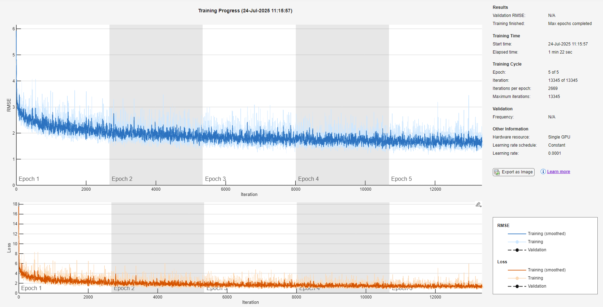
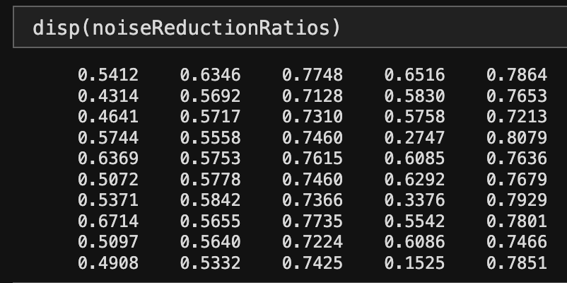

# Speech Noise Suppression with Deep Learning in MATLAB
## by Eric Vo, Kailash Rao, Siwoo Chung, Gabriel Ramos

[](https://matlab.mathworks.com/open/github/v1?repo=eric-vo/mathworks-noise-suppression&file=scripts/main.m)

## Overview

This project fine-tunes and analyzes a deep learning model for speech noise suppression using MATLAB's Audio Toolbox and Deep Learning Toolbox. The goal was to develop a denoising system that improves speech quality in noisy environments and evaluate its effectiveness using both:

- **Subjective methods** – listening-based, human-rated clarity  
- **Objective metrics** – quantitative performance (noise reduction ratio)

## Folder Structure

```
data/
├── noise/                             # Background noise samples used for mixing
├── train/                             # Training dataset
│   ├── clean_trainset_wav/            # Clean training audio
│   └── noisy_trainset_wav/            # Noisy training audio
├── validate/                          # Validation dataset
│   ├── clean_validationset_wav/       # Clean validation audio
│   └── noisy_validationset_wav/       # Noisy validation audio
├── test/
│   ├── simpleTest/                    # Small sample test case
│   │   ├── noisyInput/                # Input audio with noise
│   │   └── testOutput/                # Denoised output from simple test
│   ├── gabrielSamples/                # Gabriel's evaluation samples
│   │   ├── clean/                     # Original clean speech
│   │   ├── clean8Khz/                 # Clean speech (8 kHz)
│   │   ├── noisy8Khz/                 # Noisy input (8 kHz)
│   │   └── output_wav/                # Denoised output files
│   └── datasetSamples/                # General test set used for metrics
│       ├── clean_testset_wav/         # Clean test audio
│       ├── noisy_testset_wav/         # Noisy test audio
│       ├── clean_testset_wav_8khz/    # Clean test audio (8 kHz)
│       ├── noisy_testset_wav_8khz/    # Noisy test audio (8 kHz)
│       └── output_wav/                # Denoised output files

models/
├── denoiseNet_FineTuned_VBD.mat       # Final fine-tuned model
├── denoiseNet.mat                     # Baseline/alternative model
└── denoiseNetFullyConnected.mat       # Original pre-trained model

scripts/
├── main.m                             # Top-level script (entry point)
├── train.m                            # Script to fine-tune the model
├── generateNoisyFile.m                # Add noise to a single file
├── generateNoisyDir.m                 # Add noise to a directory of files
├── denoiseSpeechFile.m                # Denoise a single file using model
├── denoiseSpeechDir.m                 # Denoise all files in a directory
├── calculateAudioError.m              # Computes RMSE, SNR, PSNR, etc.
├── calculateNoiseReductionRatio.m     # Computes noise suppression ratio
├── resampleDir.m                      # Resamples files for compatibility

media/                                 # Image showing noise reduction ratios for Gabriel's samples

LICENSE                                # Usage restriction notice
README.md                              # Project documentation
```

## Running the Project Example

**Important:** The denoising scripts only work with **.wav** audio files.

### Running `main.m` will:

- Fine-tune the pre-trained model
- Add noise to custom audio samples  
- Denoise multiple samples using the fine-tuned model  
- Calculate the noise reduction ratio between the noisy and denoised audio

### How to Run `main.m`:
1. Add `scripts/` to your MATLAB path.
2. (Optional) To enable initial training of the model, uncomment line 7 in `main.m` (may be resource-intensive).
3. Run the script. The denoised files will be outputted in `data/test/gabrielSamples/output_wav/` and `data/test/datasetSamples/output_wav/`.

## Functions
### Used in `main.m`
- **`train(model, cleanDir, noisyDir, outputPath, options: useGPU=0)`**
  - Fine-tunes a denoising neural network using paired clean and noisy audio
- **`generateNoisyDir(cleanInputDir, noiseDir, noisedOutputDir, options: snr_dB=10, clear=1)`**
  - Generates 5 noisy audio files for every clean audio file
- **`denoiseSpeechDir(model, noisyInputDir, denoisedOutputDir, clear=1)`**
    - Denoises specified directory of noisy audio files
- **`calculateNoiseReductionRatio(denoisedAudioArray, cleanOriginalDir, noisyOriginalDir, numDenoised=1)`**
  - Computes noise reduction ratios of denoised over noisy audio
 
### Helper Functions
- **`generateNoisyFile(cleanPath, noisePath, outputPath, snr_dB)`**
  - Adds background noise to a clean audio file at a specified SNR
- **`denoiseSpeechFile(model, noisyInput, denoisedOutputDir)`**
  - Denoises a single noisy file
- **`calculateAudioError(cleanAudio, denoisedAudio)`**
  - Calculates several error metrics (RMSE, SNR, PSNR, correlation, MAE) comparing the model's denoised audio and the original clean audio
- **`resampleDir(inputDir, outputDir, targetFs)`**
  - Resamples the specified directory of audio files to the desired target frequency (used for subjective evaluation)

## Model & Features
- **Model:** Pre-trained model from MATLAB's [Denoise Speech Using Deep Learning Networks Example](https://www.mathworks.com/help/audio/ug/denoise-speech-using-deep-learning-networks.html)  
- **Training Data:** Used the [VoiceBank-Demand (VBD) Dataset](https://datashare.ed.ac.uk/handle/10283/1942) to fine-tune pre-trained model  
- **Preprocessing:** STFT with Hamming windows  
- **Feature Context:** 8-segment windows  
- **Sampling Rate:** 8 kHz


*Metrics from fine-tuning the pre-trained model. The two graphs display the root mean square error (RMSE) and training loss of the model over time.*

## Dependencies
- MATLAB R2025a or later  
- Audio Toolbox  
- Deep Learning Toolbox  
- Signal Processing Toolbox  

## Project Timeline

**Time Frame:** 6/27/2025 – 7/25/2025 (4 weeks)

- Conducted a literature review on deep learning-based speech noise suppression  
- Downloaded and prepared speech/noise datasets from the [Denoise Speech Using Deep Learning Networks Example](https://www.mathworks.com/help/audio/ug/denoise-speech-using-deep-learning-networks.html)
- Prepared our own clean sample data (gabrielSamples) 
- Generated noisy samples using custom noise at various SNR levels  
- Fine-tuned a pre-trained model on VoiceBank-Demand samples  
- Applied STFT preprocessing and neural network inference  
- Evaluated denoising performance via:  
  - Subjective listening tests (clarity scale: 1–5)  
  - Objective metrics (Noise reduction ratio, RMSE, SNR, correlation, PSNR, etc.)

### Future Improvements
Given more time and capable hardware, we would implement the following changes:
- Develop and train our own Deep Learning Model from scratch using larger datasets
- Use a validation set in conjunction with the training set while fine-tuning model 

## Results

**Objective Results**

- **Average Noise Reduction Ratio:** `0.625` for `data/test/gabrielSamples`, `0.732` for `data/test/datasetSamples`
  - The average reduction ratio specifies the proportion of noise the model removed from the noisy files. Positive values indicate less noisy output, while negative values indicate noisier output.
  - On average, 62.5% and 73.2% of the noise was removed for `data/test/gabrielSamples` and `data/test/datasetSamples`, respectively.
 
- **Individual Noise Reduction Ratios for `data/test/gabrielSamples`:**



**Subjective Ratings** (from `data/test/gabrielSamples/output_wav/`):

| File                          | Clarity (1–5) |
|-------------------------------|---------------|
| `10_waves_5dB_dn.wav`         | 3.7           |
| `10_pencils_5dB_dn.wav`       | 3.2           |
| `10_jet_city_birds_5db_dn.wav`| 4.0           |
| `10_cafe_5db_dn.wav`          | 3.1           |
| `10_birds_farm_5db_dn.wav`    | 3.1           |

## Contributors

| Name           | Contributions                                                                        | Files Worked On                                                                      |
|----------------|--------------------------------------------------------------------------------------|--------------------------------------------------------------------------------------|
| Siwoo Chung    | Noising algorithm, noising test dataset function documentation                       | `main.m`, `generateNoisyFile.m`, `generateNoisyDir.m`                                |
| Kailash Rao    | Model tuning, denoising test dataset, aggregating functions in `main.m`              | `main.m`, `train.m`, `denoiseSpeechFile.m`, `denoiseSpeechDir.m`                     |
| Eric Vo        | Noise reduction ratio metrics, refactoring functions                                 | `main.m`, `resampleDir.m`, `calculateNoiseReductionRatio.m`, `calculateAudioError.m` |
| Gabriel Ramos  | Dataset preparation, README documentation, updates on key requirements and deadlines | `README.md`                                                                          |
